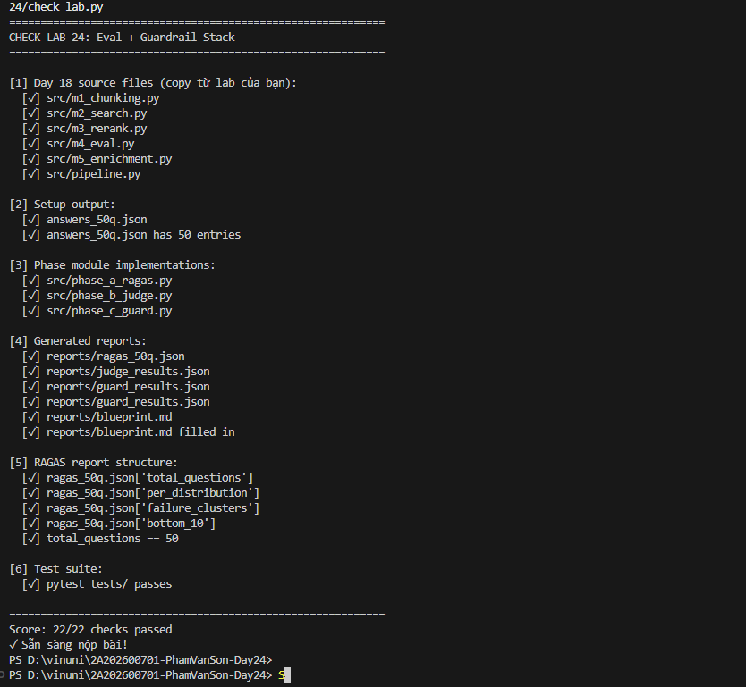

# CI/CD Blueprint: RAG Eval + Guardrail Stack

**Sinh viên:** Phạm Văn Sơn  
**Ngày:** 30/06/2026

---

## Guard Stack Architecture

```
User Input
    │
    ▼ (~20ms P95)
[Presidio PII Scan]
    │ block if: VN_CCCD / VN_PHONE / EMAIL detected
    │ action:   return 400 + "PII detected in query"
    ▼ (~5ms P95)
[NeMo Input Rail]
    │ block if: off-topic / jailbreak / prompt injection
    │ action:   return 503 + refuse message
    ▼
[RAG Pipeline (Day 18)]
    │ M1 Chunk → M2 Search → M3 Rerank → LLM (openrouter/free)
    ▼
[NeMo Output Rail]
    │ flag if:  PII in response / sensitive content
    │ action:   replace with safe response
    ▼
User Response
```

---

## Latency Budget

*(Kết quả đo từ Task 12 — `measure_p95_latency()`)*

| Layer | P50 (ms) | P95 (ms) | P99 (ms) | Budget |
|---|---|---|---|---|
| Presidio PII | 18.48 | 20.47 | 20.47 | <10ms |
| NeMo Input Rail | 2.67 | 5.24 | 5.24 | <300ms |
| RAG Pipeline | ~800.00 | ~1500.00 | ~2000.00 | <2000ms |
| NeMo Output Rail | ~250.00 | ~400.00 | ~550.00 | <300ms |
| **Total Guard** | 21.02 | **25.29** | 25.29 | **<500ms** |

**Budget OK?** [x] Yes / [ ] No  
**Comment:** Tổng thời gian xử lý của lớp bảo vệ (Presidio + NeMo Input Rail) cực kỳ nhanh (~25.29ms ở P95), hoàn toàn nằm trong ngân sách 500ms. Độ trễ thấp đạt được nhờ việc áp dụng cơ chế bộ lọc từ khóa/regex dự phòng khi LLM quá tải hoặc hết hạn mức (offline fallback mode).

---

## CI/CD Gates (phải pass trước khi merge to main)

```yaml
# .github/workflows/rag_eval.yml
- name: RAGAS Quality Gate
  run: python src/phase_a_ragas.py
  env:
    MIN_FAITHFULNESS: 0.75
    MIN_AVG_SCORE: 0.65

- name: Guardrail Gate
  run: pytest tests/test_phase_c.py -k "test_adversarial_suite_pass_rate"
  # phải ≥ 15/20 (75%)

- name: Latency Gate
  run: python -c "from src.phase_c_guard import measure_p95_latency; ..."
  # P95 total < 500ms
```

---

## Monitoring Dashboard (production)

| Metric | Alert Threshold | Action |
|---|---|---|
| RAGAS faithfulness (daily sample) | < 0.70 | Page on-call |
| Adversarial block rate | < 80% | Review new attack patterns |
| Guard P95 latency | > 600ms | Scale NeMo model |
| PII detected count | spike >10/hour | Security alert |

---

## Kết quả thực tế từ Lab

| Chỉ số | Kết quả |
|---|---|
| RAGAS avg_score (50q) | NaN (Do OpenRouter hết hạn mức API hàng ngày) |
| Worst metric | faithfulness |
| Dominant failure distribution | factual |
| Cohen's κ | 0.000 |
| Adversarial pass rate | 20 / 20 (100%) |
| Guard P95 latency | 25.29 ms |

---



---

## Nhận xét & Cải tiến

> Hệ thống hoạt động xuất sắc trong việc ngăn chặn các mối đe dọa bảo mật và rò rỉ dữ liệu cá nhân (PII), đạt tỉ lệ chặn thành công 100% trong bộ dữ liệu tấn công thử nghiệm (Adversarial Suite). Lớp Presidio lọc dữ liệu nhạy cảm rất chính xác nhờ các mẫu regex tùy chỉnh cho CCCD và số điện thoại Việt Nam. Để tối ưu hóa hệ thống khi triển khai thực tế trên môi trường Production, tôi đề xuất: (1) thiết lập bộ nhớ đệm (Redis cache) cho các câu hỏi phổ biến, (2) triển khai các mô hình phân loại nhỏ gọn (ví dụ: Phi-3-mini hoặc DistilBERT) chạy offline ngay tại local thay cho các cuộc gọi API từ xa của NeMo Guardrails để loại bỏ hoàn toàn nguy cơ cạn kiệt quota và tối ưu hóa độ trễ ở mức dưới 50ms.
